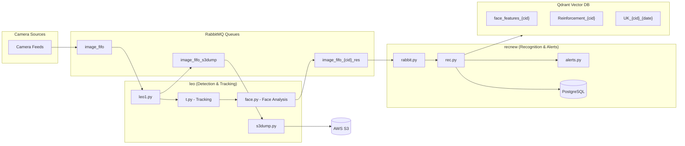

# Data Flow: Leo → Recnew Pipeline

This document explains how video frame data flows from the **leo** detection system to the **recnew** recognition and alerting system.

---

## High-Level Architecture



---

## Phase 1: LEO Detection Pipeline

### 1.1 Frame Ingestion - [leo1.py](file:///home/jzt001/leo/leo1.py)

| Step | Description |
|------|-------------|
| **Input** | Consumes from RabbitMQ queue: `image_fifo` |
| **Decryption** | Optionally decrypts AES-GCM encrypted frames |
| **Detection** | Runs **YOLOv8m** ONNX model for object detection |
| **Classes** | Filters for: Person (0), Car (2), Motorcycle (3), Bus (5), Truck (7) |
| **Thresholds** | Confidence: 0.35, NMS IoU: 0.5 |

**Key Function:** `detect_objects(img, filename)` → Returns `[([x1,y1,x2,y2], conf, cls), ...]`

### 1.2 Tracking & Face Analysis - [t.py](file:///home/jzt001/leo/t.py)

| Step | Description |
|------|-------------|
| **Tracker** | Uses `jeztsort.ImprovedTracker()` for multi-object tracking |
| **Face Detection** | Calls `face(frame)` from [face.py](file:///home/jzt001/leo/face.py) |
| **Feature Flags** | Fetches per-company settings via API: `faces`, `vehicle`, `animals`, `ppe`, `emotion` |

**Key Function:** `processtracking(frame, dets, cid, filename)`

#### Face Analysis ([face.py](file:///home/jzt001/leo/face.py)) extracts:
- 512-dimensional face embeddings (InsightFace)
- Age estimation
- Gender classification  
- Pose analysis (yaw, pitch, roll)
- Quality scores (blur, brightness)
- Emotion detection (MobileNetV2 model)

### 1.3 Output Message Structure

Each detected person is packaged with:

```python
person_data = {
    'image_path': f"{camname}_person_{count}_{image_id}_{track_id}_{date_time}.jpg",
    'Facial_Features': [...],  # 512-dim embedding vector
    'Age': 28,
    'Gender': 0,  # 0=Male, 1=Female
    'pose': "frontal",
    'Camera': "cam1",
    'Track_id': 5,
    'position': (x1, y1),
    'ppe': {'helmet': True, 'vest': False},
    'emo': "positive",
    'status': "face"  # or "no_face"
}
```

### 1.4 Publishing

| Queue | Content |
|-------|---------|
| `image_fifo_{cid}_res` | Detection results JSON in message headers |
| `image_fifo_s3dump` | Cropped images for S3 upload |
| `image_fifo_anml_vhcl` | Animal/Vehicle detections |

---

## Phase 2: RECNEW Recognition Pipeline

### 2.1 Message Consumption - [rabbit.py](file:///home/jzt001/recnew/myapp/rabbit.py)

| Step | Description |
|------|-------------|
| **Queue Discovery** | Polls RabbitMQ API for queues ending in `_res` |
| **Batching** | Collects 60 messages per batch for efficiency |
| **Parsing** | Extracts `detections` JSON from message headers |

**Key Function:** `list_rabbit_queues(i)` - Main consumer loop

```python
# Batch collection
for q in queues:
    if q["name"].endswith("res") and q["messages"] > 10:
        start_consumer(q["name"], channel, connection)
```

### 2.2 Face Recognition - [rec.py](file:///home/jzt001/recnew/myapp/rec.py)

**Key Function:** `recstart(df, cid)` - Main recognition orchestrator

#### Step 1: Collection Setup
```python
face_collection_name = f'face_features_{cid}'      # Known employees
rein_collection_name = f'Reinforcement_{cid}'      # Learning data
today_unk_collection = f'UK_{cid}_{current_date}'  # Unknown persons today
```

#### Step 2: Face Clustering (DBSCAN)
Groups faces by similarity before recognition:

```python
clustered = cluster_by_features(records, eps=0.3, min_samples=2)
# Clusters faces across the batch to reduce duplicate searches
```

#### Step 3: Qdrant Vector Search

**Function:** `searchqud(entries, face_collection_name, ...)` 

| Collection | Purpose | Score Threshold |
|------------|---------|-----------------|
| `face_features_{cid}` | Match known employees | 0.4 |
| `Reinforcement_{cid}` | Tie-breaking with recent data | 0.4 |
| `UK_{cid}_{date}` | Group unknown persons | 0.38 |

**Matching Logic:**
1. Search Qdrant for top 10 similar faces
2. Group results by employee name
3. Require **≥2 votes** for valid match
4. On tie → use Reinforcement collection
5. No match → assign to Unknown similarity group

#### Step 4: Classification Output

```python
# Final categorization
df_known   = final_df[~is_integer(face_recognition)]  # Known employees
df_unknown = final_df[is_integer(face_recognition)]   # Unknown persons
df_noface  = df[Facial_Features == "None"]           # No face detected
```

### 2.3 Database Storage - [dbqueue.py](file:///home/jzt001/recnew/myapp/dbqueue.py)

Queued data is processed and stored in PostgreSQL:

| Model | Data Source |
|-------|-------------|
| `PersonData` | Known employee detections |
| `UnknownData` | Unknown person detections |
| `NoFaceData` | Detections without face |
| `Reinforcement` | High-confidence matches for learning |

### 2.4 Alert Processing - [alerts.py](file:///home/jzt001/recnew/myapp/alerts.py)

| Alert Type | Function | Trigger |
|------------|----------|---------|
| Known Person | `checkknown()` | Employee detected in specific camera |
| Unknown Person | `checkunknown()` | Stranger in monitored area |
| PPE Violation | `checkppe()` | Missing safety equipment |
| Workflow | `workflowalert()` | Time-based presence rules |

**Delivery Channels:**
- Telegram (`send_tg_alert`)
- Email (`send_email`)
- WhatsApp (`send_whatsapp`)
- Webhooks
- Mobile push notifications

---

## Data Flow Summary

```
┌─────────────────────────────────────────────────────────────────────────┐
│                           CAMERA FRAME                                   │
└─────────────────────────────────────────────────────────────────────────┘
                                    │
                                    ▼
┌─────────────────────────────────────────────────────────────────────────┐
│ LEO: leo1.py                                                            │
│  • Consume from: image_fifo                                             │
│  • YOLOv8m detection → persons, vehicles, animals                       │
│  • Pass detections to t.py                                              │
└─────────────────────────────────────────────────────────────────────────┘
                                    │
                                    ▼
┌─────────────────────────────────────────────────────────────────────────┐
│ LEO: t.py + face.py                                                     │
│  • Track objects with jeztsort                                          │
│  • Extract 512-dim face embeddings (InsightFace)                        │
│  • Detect age, gender, emotion, PPE                                     │
│  • Queue images to S3                                                   │
└─────────────────────────────────────────────────────────────────────────┘
                                    │
                                    ▼
┌─────────────────────────────────────────────────────────────────────────┐
│ RABBITMQ: image_fifo_{company_id}_res                                   │
│  • Headers contain JSON detection data                                  │
│  • One message per frame with all persons                               │
└─────────────────────────────────────────────────────────────────────────┘
                                    │
                                    ▼
┌─────────────────────────────────────────────────────────────────────────┐
│ RECNEW: rabbit.py                                                       │
│  • Poll for _res queues with messages > 10                              │
│  • Batch 60 messages → DataFrame                                        │
│  • Call recstart(df, cid)                                               │
└─────────────────────────────────────────────────────────────────────────┘
                                    │
                                    ▼
┌─────────────────────────────────────────────────────────────────────────┐
│ RECNEW: rec.py                                                          │
│  • Cluster faces by similarity (DBSCAN)                                 │
│  • Search Qdrant for known employees                                    │
│  • Assign unknown groups                                                │
│  • Categorize: known / unknown / no_face                                │
└─────────────────────────────────────────────────────────────────────────┘
                                    │
                    ┌───────────────┼───────────────┐
                    ▼               ▼               ▼
            ┌───────────┐   ┌───────────┐   ┌───────────┐
            │ PostgreSQL│   │   Qdrant  │   │  Alerts   │
            │ Storage   │   │  Update   │   │ Dispatch  │
            └───────────┘   └───────────┘   └───────────┘
```

---

## Key Technologies

| Component | Technology |
|-----------|------------|
| Object Detection | YOLOv8m (ONNX) |
| Face Analysis | InsightFace (512-dim embeddings) |
| Emotion Detection | MobileNetV2 (fine-tuned) |
| Message Queue | RabbitMQ |
| Vector Database | Qdrant (gRPC) |
| Primary Database | PostgreSQL |
| Object Storage | AWS S3 |
| Clustering | DBSCAN (scikit-learn) |
