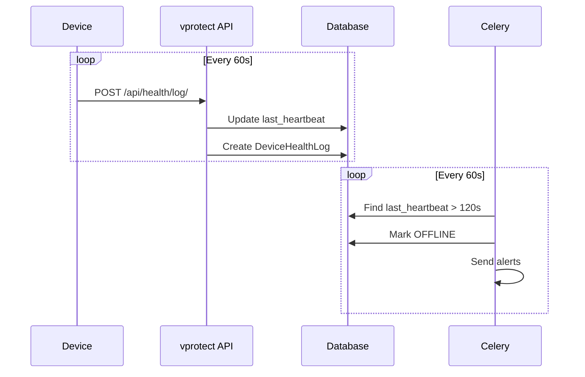

# Device Health Monitoring System - Full Documentation

## Overview

A hierarchical health monitoring system for DVR/NVR devices, HDDs, and cameras with:
- Real-time heartbeat logging
- Offline detection and alerting
- Cloud recording status tracking
- Pre-computed summaries for scale

---

## 1. User Hierarchy

```
superAdmin → clientAdmin → zoneAdmin → stateAdmin → districtAdmin → locationOperator
                                                                         └── Site → Device → DVR → Cameras/HDDs
```

---

## 2. Timing Configuration

| Component | Interval | Purpose |
|-----------|----------|---------|
| Device heartbeat | **60 seconds** | Sends health data to API |
| Offline threshold | **120 seconds** | Device marked offline if no heartbeat |
| Cloud recording segment | **5 minutes** | Standard video segment length |
| Cloud offline threshold | **10 minutes** | Cloud recording marked down |
| Location summary update | **5 minutes** | Aggregate location stats |
| Hierarchy summary update | **15 minutes** | Rollup district→state→zone |

---

## 3. Heartbeat Flow



---

## 4. Beat Log Payload

```json
{
  "api_key": "xxx-xxx-xxx",
  "device_id": "DEVICE-001",
  "device_name": "Main Server",
  "device_status": "ONLINE",
  "device_ip": "192.168.1.100",
  "location_id": "LOC-001",
  "cpu_percent": 45.2,
  "ram_percent": 62.8,
  "uptime_seconds": 864000,

  "dvr_details": [
    {
      "dvr_id": "DVR-001",
      "dvr_name": "Main Building",
      "status": "ONLINE",
      "model": "Hikvision DS-7608",
      "is_recording": true,
      "hdds": [
        {
          "hdd_id": "HDD-1",
          "name": "Seagate 2TB",
          "total_gb": 2000,
          "used_gb": 1500,
          "percent": 75,
          "status": "OK",
          "temperature_c": 38,
          "recording_days": 14
        }
      ],
      "cameras": [
        {
          "camera_id": "CAM-001",
          "name": "Entrance",
          "channel": 1,
          "status": "UP",
          "resolution": "1920x1080",
          "fps": 25,
          "local_recording": {"is_recording": true, "recording_days": 14},
          "cloud_recording": {"is_active": true, "last_upload": "2026-01-17T01:00:00"}
        }
      ]
    }
  ]
}
```

---

## 5. Models

### stream_Device (Modify Existing)

```python
# Add fields:
last_heartbeat = models.DateTimeField(null=True)
is_online = models.BooleanField(default=True)
location_id = models.CharField(max_length=100, null=True, db_index=True)
```

### DeviceHealthLog (New)

```python
class DeviceHealthLog(models.Model):
    device = models.ForeignKey('stream_Device', on_delete=models.CASCADE)
    user = models.ForeignKey('CustomUser', on_delete=models.CASCADE)
    device_id = models.CharField(max_length=100, db_index=True)
    location_id = models.CharField(max_length=100, db_index=True)
    device_status = models.CharField(max_length=20)
    device_ip = models.CharField(max_length=50, null=True)
    cpu_percent = models.FloatField(null=True)
    ram_percent = models.FloatField(null=True)
    uptime_seconds = models.BigIntegerField(null=True)
    dvr_details = models.JSONField(default=list)
    created_at = models.DateTimeField(auto_now_add=True, db_index=True)
```

### LocationHealthSummary (New)

```python
class LocationHealthSummary(models.Model):
    location_id = models.CharField(max_length=100, unique=True)
    district_id = models.CharField(max_length=100, db_index=True)
    devices_total = models.IntegerField(default=0)
    devices_online = models.IntegerField(default=0)
    dvrs_total = models.IntegerField(default=0)
    dvrs_online = models.IntegerField(default=0)
    cameras_total = models.IntegerField(default=0)
    cameras_online = models.IntegerField(default=0)
    hdds_total = models.IntegerField(default=0)
    hdds_critical = models.IntegerField(default=0)
    avg_hdd_percent = models.FloatField(default=0)
    updated_at = models.DateTimeField(auto_now=True)
```

### DistrictHealthSummary, StateHealthSummary, ZoneHealthSummary

Same pattern with aggregated stats rolled up from below.

---

## 6. API Endpoints

| Endpoint | Method | Purpose |
|----------|--------|---------|
| `/api/health/log/` | POST | Receive heartbeat + health data |
| `/api/health/zones/` | GET | All zones summary |
| `/api/health/zone/{id}/states/` | GET | Drill into states |
| `/api/health/state/{id}/districts/` | GET | Drill into districts |
| `/api/health/district/{id}/locations/` | GET | Drill into locations |
| `/api/health/location/{id}/devices/` | GET | Drill into devices |
| `/api/health/device/{id}/` | GET | Full device details |
| `/api/health/device/{id}/history/` | GET | Historical logs |

---

## 7. Celery Tasks

| Task | Schedule | Action |
|------|----------|--------|
| `check_offline_devices` | 60s | Find stale heartbeats (>120s), send alerts |
| `check_cloud_recording` | 60s | Find cameras with no upload (>10min) |
| `update_location_summaries` | 5 min | Aggregate per location |
| `update_hierarchy_summaries` | 15 min | Rollup to district/state/zone |

---

## 8. Cloud Recording Monitoring

- Segment duration: **5 minutes**
- Offline threshold: **10 minutes** (2x segment)
- Check: `now() - last_entry.end_time > 10min` → DOWN

